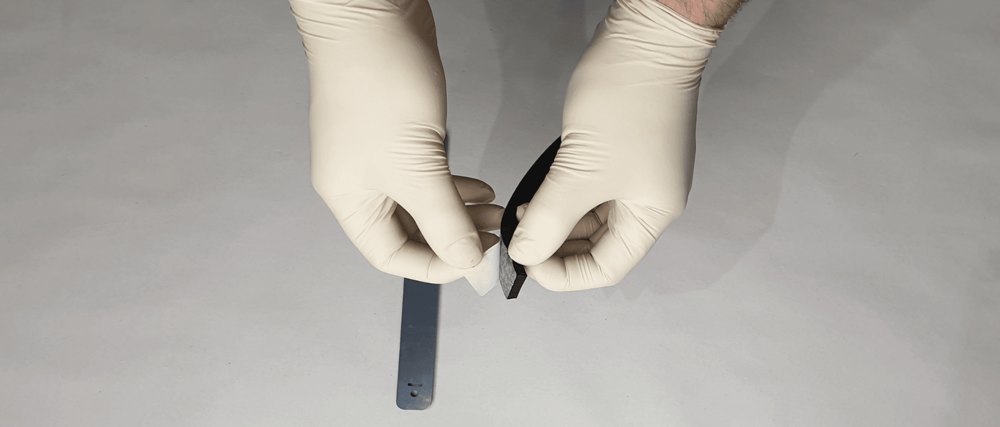
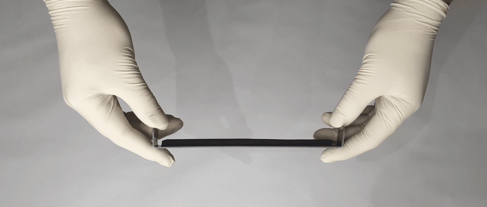

# Welcome

Welcome to OpenGuard! Openguard V1.0 is a quick and easy make face shield designed for frontline workers fighting the Covid-19 pandemic. It is designed with readily available parts and tools to make it both fast and affordable to make.

* * *

Openguard plans are Open Source and released under the GNU General Public Licence which can be viewed [here](https://www.gnu.org/licenses/gpl-3.0.html).

# Preparation

Access to tooling which can cut plastic is required. The design has been optimised to use simple shapes and can be manufactured using a range of different processing techniques. Described below is an example which was built for prototyping and proof of concept purposes.It should be noted that the material and design can be modified as required to suit tooling and equipment available. You can find all CAD files for download [here](/src/OpenGuardV1.0.zip)

# Headband

This headband is made from semi-flexible plastic of thickness 1mm up to 2mm. This can be cut from sheets on an automated CNC punch or milling machine. Other cutting or jet processes may be suitable depending on the material. For our prototypes we manufactured from 2mm PVC which is inexpensive and readily available. If you want to mass produce these for your local community and don't have a punch machine lying around, contact a local engineering company and ask if they can prepare the parts for you. If this is not a service they can offer they will most likely point you in the right direction.

# Clear Face Shields

For the face shield we used A4 binder cover acetate sheets. These are readily available both locally and online. To prepare the sheet we used an A4 4-hole punch to make the holes for fixing. We have rounded the corners of these sheets as they can be quite sharp. We did this with a scissors but could be done in bulk with a guillotine or punch when available.

# Headband Padding

The headband padding is made from foam tape with adhesive backing, 20mm wide, 5 to 10mm thick and cut to 170mm in length. For our prototypes we used EPDM foam but any available foam can be used. Most suppliers of adhesive tapes will stock this. You may also find rolls in hardware, plumbing and other parts shops. A phone call to any of these locations will help you source it. If they don't supply the product directly they will have a source for it or be able to point you in the right direction. This is easy cut using household scissors as it comes in long rolls.

# Rivets

Rivets were chosen because they are readily available, providing a fast, heavy duty, low profile fixing of all components. Two kinds of rivets can be used for this application. The first is a 5mm dome head pop-rivet. This rivet requires a rivet gun in order to secure the fixing in place and trim the excess. It is also suggested that you use a mechanically assisted rivet gun over a hand riveter. Repetitive use of a hand riveter is physically straining. The best will in the world will be broken if you try to assemble any more than 20 of these in one go without one. These are expensive tools, it may be possible to rent one or have one donated by a tool supplier.

The second kind of rivet is a 5mm plastic push rivet. These are also readily available from local and online sellers. These rivets need to have a grip depth of approx. 3mm to maintain comfort for the person wearing it. Push rivets are a tooless soltuion and can be popped into place by hand. These rivets dont have the same strength as the pop-rivets and will be more likely to separate during extended use of the guard.

# Step 1 - Materials and Tools

# Important Note

Implement strict cleanliness in the area where you will work, ensure to wear clean disposable gloves and face mask where possible during assembly to minimise the risk of contaminating the finished product. Follow guidelines from trusted sources such as the WHO.

# Step 2 - Headband Preparation

# Inner Headband

- Remove protective tape from adhesive strip

- Adhere the foam material which you cut to length 170mm on the middle of the inner head band

- Hand bend the two sides at the rectangle cutouts.

# Outer Headband

- For the outer head band simply hand bend the plastic at the two rectangle cutouts marked below.

# Step 3 - Visor Preparation

Using the 4-hole punch, make 4 holes along the edge of the plastic binder cover acetate. Round the corners of the plastic sheet to ensure the other PPE is not cut or the user is not injured.

# Step 4 - Assembly

Bring the inner headband with foam, outer headband and punched visor together. Fix all together using pop or plastic rivets. Repeat this on both sides. The outer headband will require a little pressure to have it bend to shape to align the rivet holes. The two rivets at the front can be inserted or omitted if the structure is secure enough without them.

 

Once completed bend the toothed side of the outer headband around the non toothed side of the outer headband and pass it through the rectangle hole. You will need to twist the toothed side of the headband in order for it to pass through the locking hole. This is the adjustable mechanism for fitting the headband to the size of the user's head. Once correctly adjusted, pass the excess toothed material through the larger second rectangle hole to tidy it away.

# Step 5 - Bag and Label

Place the visors in a clean bag and tape the bag closed. Label the bag with the notes below:

*   Clean using an alcohol wipe before use
*   Date : DD-MM-YY  

The pack date allows the user to quarantine the bags for a number of days to ensure an adequate time delay between packing and use. Please use guidelines from the WHO website or government bodies to ensure adequate advised time has lapsed such that any pathogens contained within the bag during packaging have been rendered inactive.
